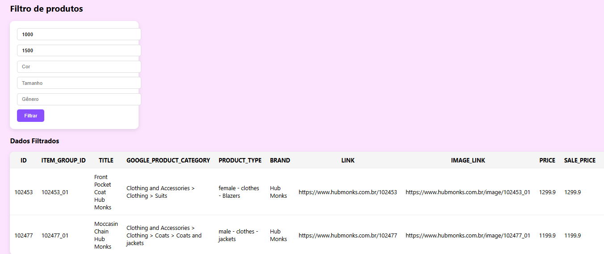
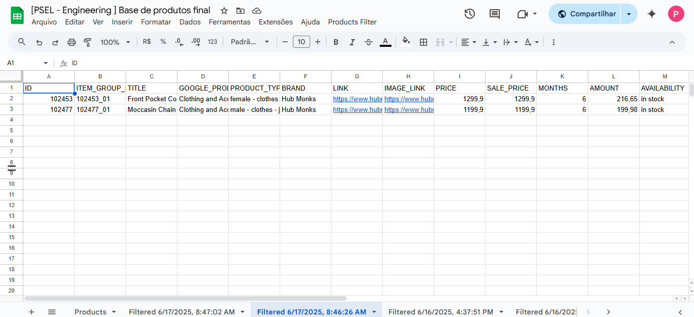

# Save-Time Excel

## 📚 Sumário

- [🚀 What is Google Apps Script?](#-what-is-google-apps-script)
- [💡 Why Use This?](#-why-use-this)
- [🔍 The Logic Behind It](#-the-logic-behind-it)
- [👨‍💻 How to Use Interface](#-how-to-use-interface)
- [🔹 Extra](#extra)


## ⚡ Pré-requisitos

- Uma conta **Google**.
- Uma planilha no **Google Drive** denominada `Products`.
- A planilha deve possuir as colunas: `SALE_PRICE, COLOR, SIZE, GENDER`.
- A **URL** do script implantado.

This repository provides a simple and effective solution to help your team filter `.xlsx` files efficiently.  
It leverages **Google Apps Script**, along with **HTML** and **CSS**, to create a lightweight, web-based interface for filtering Excel data directly from your Google Drive.

## 🚀 What is Google Apps Script?

According to Google:

> *"Apps Script is a cloud-based JavaScript platform powered by Google Drive that lets you integrate with and automate tasks across Google products."*

In this project, we use Apps Script to work directly with Excel files stored in your Google Drive.  

Whether you want to integrate this tool into your workflow, understand the logic behind it, or explore how it was built you're in the right place!

## 💡 Why Use This?

- No need for complex Excel formulas.
- Simple and user-friendly web interface.
- Easily customizable for different filtering needs.
- Fast deployment inside your Google Workspace.

## 📁 Tech Stack

- **Google Apps Script** for backend logic and integration with Google Sheets.
- **HTML + CSS** for building the filtering form and UI.

## 🔍 The Logic Behind It

Before jumping into code, we need to understand the real problem and why it matters.

Filtering data in large spreadsheets can be:
- **Confusing** for non-technical team members.
- **Time-consuming**, especially when dealing with complex formulas.
- **A productivity bottleneck**, which ultimately means **lost time, money, and focus**.

If your team frequently works with large `.xlsx` files, applying filters manually becomes inefficient.  
This tool simplifies the filtering process through a guided form, allowing users to focus on what matters most the **results**.

Picture your sheet as a grid, with **rows** (X) and **columns** (Y).  
Each column has a header, which we can use as its index — this lets us identify and retrieve the values we need with mathematical precision.

But how do we implement this?

First, we retrieve the data from our sheet:
```javascript
function getProducts() {
  var ss = SpreadsheetApp.getActiveSpreadsheet();
  var sheet = ss.getSheetByName("Products");

  if (!sheet) {
    throw new Error("Base sheet does not exist.");
  }

  var fullData = sheet.getDataRange().getValues();
  var headers = fullData[0];
  var products = fullData.slice(1);

  return {
    headers: headers,
    products: products
  };
}
```
Here:
>- getDataRange() grabs the range of cells with data.
>- getValues() converts them into a 2D array.

The first row (fullData[0]) contains the column headers.
The rest (fullData.slice(1)) contains the actual data.

We have now:
>- The headers for each column.
>- All the data from the main sheet (Products).

We need to enable users to filter this data. We have a few options:
>- minimum price
>- maximum price
>- color
>- size
>- gender

Instead of adding another sheet with filter criteria, we chose Option 2 a custom HTML form:

```javascript
function filterProductsList(products, headers, filter) {
  // Get column indices
  var idxPrice = headers.indexOf("SALE_PRICE");
  var idxColor = headers.indexOf("COLOR");
  var idxSize = headers.indexOf("SIZE");
  var idxGender = headers.indexOf("GENDER");

  // Parse filter values with defaults
  var minPrice = parseFloat(filter.minPrice) || 0;
  var maxPrice = parseFloat(filter.maxPrice) || Number.MAX_VALUE;
  var color = (filter.color || '').toString().toLowerCase().trim();
  var size = (filter.size || '').toString().toLowerCase().trim();
  var gender = (filter.gender || '').toString().toLowerCase().trim();

  // Filter products based on criteria
  return products.filter(function (prod) {
    var price = parseFloat(prod[idxPrice]) || 0;
    var productColor = prod[idxColor].toString().toLowerCase().trim();
    var productSize = prod[idxSize].toString().toLowerCase().trim();
    var productGender = prod[idxGender].toString().toLowerCase().trim();

    return (
      price >= minPrice &&
      price <= maxPrice &&
      (color === '' || productColor === color) &&
      (size === '' || productSize === size) &&
      (gender === '' || productGender === gender)
    );
  });
}

```
Filtering products:
```javascript
function filterProducts(data) {
  // Get all products data
  var result = getProducts();
  var headers = result.headers;
  var products = result.products;

  // Filter products and create new sheet
  var filtered = filterProductsList(products, headers, data);
  var newSheetName = createFilteredSheet(filtered, headers);

  return {
    message: "Data successfully filtered!",
    newSheetName: newSheetName,
    products: filtered,
    headers: headers
  };
}

```

Finally, we create a new sheet to show the results:
```javascript
function createFilteredSheet(filteredProducts, headers) {
  var ss = SpreadsheetApp.getActiveSpreadsheet();

  // Create sheet with timestamp in name
  var newSheetName = "Filtered " + new Date().toLocaleString("en-US");

  var newSheet = ss.insertSheet(newSheetName);

  // Add headers and data
  newSheet.appendRow(headers);
  filteredProducts.forEach(function (item) {
    newSheet.appendRow(item);
  });

  return newSheetName;
}
```

After the script runs, it displays a message stating that everything was successfully processed:
 ```javascript
return {
  message: "Data successfully filtered!",
  newSheetName: newSheetName,
  products: filtered,
  headers: headers
};

// The user can then view the results in the new sheet or in the html web app table.
```
---
## Extra!

This function handles GET requests from the web app, allowing users to view it through a link
```javascript
function doGet(e) {
  return HtmlService.createHtmlOutputFromFile('Index');  
}
```
---
## 👨‍💻 How to Use Interface

1️⃣ Use this link:

APP URL: https://script.google.com/macros/s/AKfycbzZ9Ct0KBaMeaH59LdO47nx-pe14ChQRIDdX3Btv9JliAgM4IqodgjUBEb9JB2mUPDVXA/exec
Code: AKfycbzZ9Ct0KBaMeaH59LdO47nx-pe14ChQRIDdX3Btv9JliAgM4IqodgjUBEb9JB2mUPDVXA
Excel File URL: https://docs.google.com/spreadsheets/d/12MNsZ75770WujD9fvctKwuUTS-8DzyQvUx1e7BXLhNg/edit?usp=drive_link

2️⃣ Fill in the inputs.

3️⃣ Check the results in the Excel file.

4️⃣ You can also view the results directly on the webpage as an HTML table.

---
## 🖼 Exemplo





